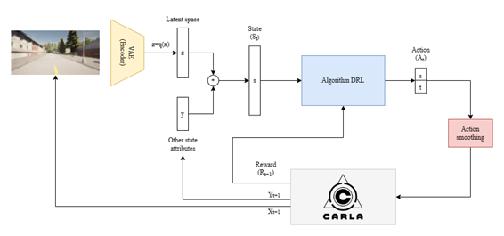
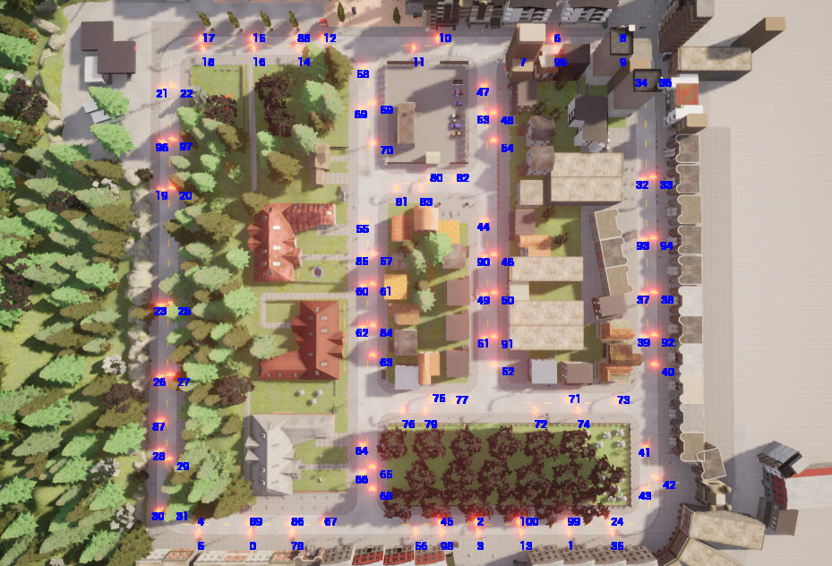
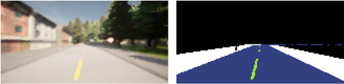

# 🚗 CARLA-SB3-RL-Training-Environment
<p align="center">
  
</p>


This repo provides an out-of-the-box training and evaluation environment for 
conducting multiple experiments using DRL in the CARLA simulator using the library
[Stable Baselines 3](https://stable-baselines3.readthedocs.io/en/master/) including the configuration of the reward function, state, and algorithm used. 


Video with examples of the pretained models provided: [here](https://youtu.be/pSp8i3DJcKY)
<p align="center">
  
</p>

This work has been developed as part of the Bachelor's Thesis "Application of Deep Reinforcement Learning in autonomous driving" by Alberto Maté at UC3M.


## 📥 Installation
1. Install `CARLA 0.9.13` from [here](https://github.com/carla-simulator/carla/releases/tag/0.9.13). (Note: `CARLA 0.9.13` is the only version tested with this repo)
2. Create a venv and install the requirements:
```bash
python3 -m venv venv
source venv/bin/activate
pip install -r requirements.txt
```
3. Export CARLA installation path to `$CARLA_ROOT`:
```bash
export CARLA_ROOT=<path to carla installation>
```

## 🛠️ Usage
### Configuration file
The configuration is located in `config.py`. It contains the following parameters:
- `algorithm`: The RL algorithm to use. All algorithms from Stable Baselines 3 are supported.
- `algoritm_params`: The parameters of the algorithm. See the Stable Baselines 3 documentation for more information.
- `state`: The state to use as a list of atributes. For example, `steer, throttle, speed, angle_next_waypoint, maneuver, waypoints, rgb_camera, seg_camera, end_wp_vector, end_wp_fixed, distance_goal`
 See the `carla_env/state_commons.py` file for more information.
- `vae_model`: The VAE model to use. This repo contains two pretrained models: `vae_64` and `vae_64_augmentation`. If `None`, no VAE is used.
- `action_smoothing`: Whether to use action smoothing or not.
- `reward_fn`: The reward function to use. See the `carla_env/reward_functions.py` file for more information.
- `reward_params`: The parameters of the reward function.
- `obs_res`: The resolution of the observation. It's recommended to use `(160, 80)`
- `seed`: The random seed to use.
- `wrappers`: A list of wrappers to use. Currently there are two implemented: `HistoryWrapperObsDict` and `FrameSkip`. See the `carla_env/wrappers.py` file for more information.

### Training
To train a model, run:
```bash
python train.py --config <number of the config to use> --total_timesteps <number of timesteps to train>
```
For example:
```bash
python train.py --config 0 --total_timesteps 1000000
```
The training results will be saved in the `tensorboard` folder. You can open it with:
```bash
tensorboard --logdir tensorboard
```

### Evaluation
To evaluate a model, run:
```bash
python evaluate.py --config <number of the config to use> --model <path to the model to evaluate>
```
The evaluation routes can be changed inside `carla_env/envs/carla_env.py` in the `eval_routes` variable. Choose two points in the map and add them to the list.
<p align="center">
  
</p>

### Train and evaluate multiple models
To train and evaluate multiple models run the `run_experiments.py` script. It will train and evaluate all the models specified in the `run_experiments.py` file.
```bash
python run_experiments.py
```

### Train VAE models
In this repo you can also train and eval a VAE model. To train a VAE model, run:
```bash
python vae/train_vae.py --epochs <number of epochs to train>
```
<p align="center">
  
</p>

There are also some script to recollect data (RGB and segmentation images) from CARLA. To collect data from CARLA manually, run:
```bash
python carla_env/envs/collect_data_manual_env.py
```

To collect data from CARLA automatically using a RL agent in early stages, run:
```bash
python carla_env/envs/collect_data_rl_env.py
```
## 📑 Citation
If you use this repo, please cite this project.

```
@software{Mate_CARLA-SB3-RL-Training-Environment_out-of-the-box_training_2023,
  author = {Mate, Alberto},
  month = jun,
  title = {{CARLA-SB3-RL-Training-Environment: out-of-the-box training and evaluation environment for DRL in CARLA simulator}},
  url = {https://github.com/alberto-mate/CARLA-SB3-RL-Training-Environment},
  version = {1.0.0},
  year = {2023}
}
```
